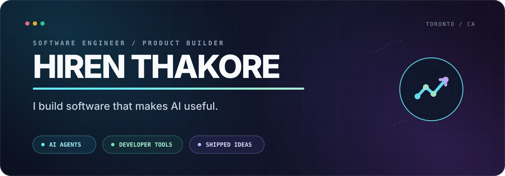

<div align="center">
  
</div>

<div align="center">
  <a href="https://hirenthakore.com/"><b>Portfolio</b></a>
  &nbsp;&nbsp;·&nbsp;&nbsp;
  <a href="https://linkedin.com/in/hirenthakore"><b>LinkedIn</b></a>
  &nbsp;&nbsp;·&nbsp;&nbsp;
  <a href="mailto:hiren.thakore58@gmail.com"><b>Let's build</b></a>
</div>

<br />

> I turn emerging AI capabilities into software people can actually use — fast enough to learn, solid enough to keep.

I am a Toronto-based software engineer working where **AI agents**, **developer experience**, and **small, sharp products** overlap. My favorite projects remove a tedious loop, expose a hidden cost, or make a complex system feel obvious.

## Selected systems

<table>
<tr>
<td width="50%" valign="top">

### [llm-speedtest-mcp](https://github.com/thakoreh/llm-speedtest-mcp)

**Speedtest.net for language models.** Benchmark inference latency from any MCP client—with zero telemetry.

`JavaScript` · `MCP` · `MIT`

</td>
<td width="50%" valign="top">

### [agent-tally](https://github.com/thakoreh/agent-tally)

**One cost ledger for every coding agent.** See what autonomous development actually costs across CLIs.

`Python` · `Developer tooling` · `MIT`

</td>
</tr>
<tr>
<td width="50%" valign="top">

### [hermes-exploration-plugin](https://github.com/thakoreh/hermes-exploration-plugin)

**A discovery layer for AI agents.** Find and share useful tools, APIs, models, and workflows.

`Python` · `Agents` · `MIT`

</td>
<td width="50%" valign="top">

### [vibecheck](https://github.com/thakoreh/vibecheck)

**A reality check for AI-generated code.** Catch security issues, anti-patterns, and maintenance debt before they ship.

`Python` · [`PyPI`](https://pypi.org/project/vibechecker/) · `MIT`

</td>
</tr>
<tr>
<td width="50%" valign="top">

### [apicaller](https://github.com/thakoreh/apicaller)

**API docs, compressed into action.** Paste an endpoint and get the curl commands you need.

`TypeScript` · `Developer experience`

</td>
<td width="50%" valign="top">

### [Model Eval Daily](https://github.com/thakoreh/modelevaldaily)

**A living view of model performance.** Follow the fast-moving AI model landscape without drowning in release noise.

`Astro` · [`Live site`](https://modelevaldaily.vercel.app)

</td>
</tr>
</table>

## My operating system

```text
find friction  →  build the smallest useful thing  →  put it in real hands
      ↑                                                   ↓
      └──────────── measure, learn, simplify ─────────────┘
```

I optimize for:

- **Useful over theatrical** — the best demo becomes a dependable daily tool.
- **Observable over mysterious** — costs, failures, and tradeoffs should be visible.
- **Small surface area** — fewer moving parts, clearer ownership, faster iteration.
- **Shipping as research** — working software teaches more than another planning document.

## Current frontier

```yaml
building:
  - agents that can use tools safely across files, browsers, terminals, and chat
  - infrastructure for model evaluation, cost visibility, and reliable automation
  - focused products that turn one painful workflow into one satisfying action

exploring:
  - memory and deterministic conflict resolution for local-first agents
  - evals that measure whether an AI workflow is useful, not merely impressive
  - security boundaries for software that can act on a user's behalf
```

## Tools I reach for

**Core:** Python · TypeScript · JavaScript · Go · SQL<br />
**Product:** React · Next.js · Astro · Tailwind · FastAPI · Node.js<br />
**Systems:** PostgreSQL · Redis · Docker · GitHub Actions · AWS<br />
**AI:** MCP · tool use · evals · retrieval · browser automation · LLM APIs

---

<div align="center">
  <h3>Have a difficult problem with a useful outcome?</h3>
  <p><a href="mailto:hiren.thakore58@gmail.com"><b>Tell me about it →</b></a></p>
  <sub>Toronto, Canada · Open to ambitious engineering and product work</sub>
</div>
